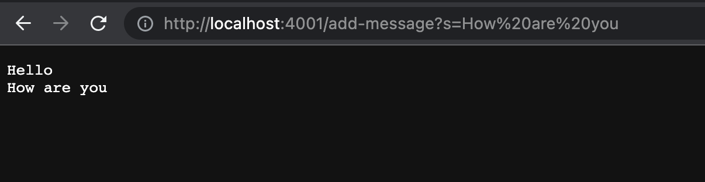
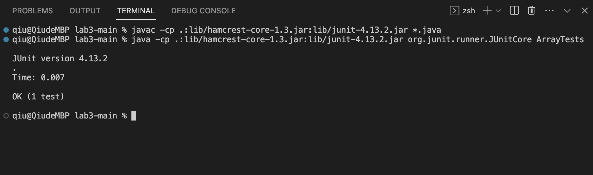
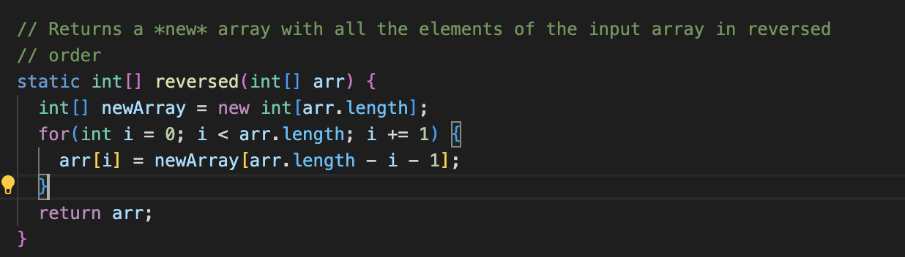
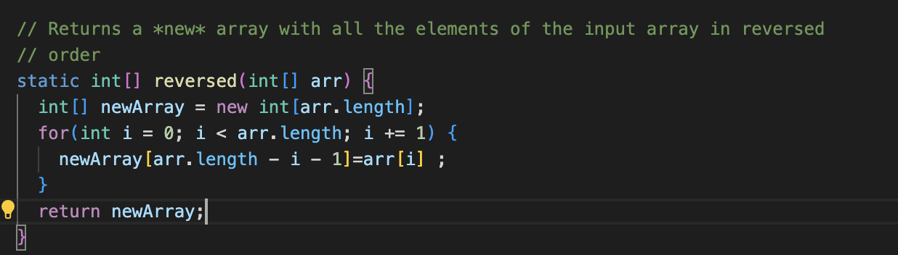

## Jiaqiu Wu Lab report2
# Servers and Bugs

### Part1
The code for my StringServer.java is below:

The first screenshot of using `/add-messages`:

Thd second screenshot of using `/add-messages`:

- The handleRequest() method is called.
- The relevant argument to this handleRequest() method is url: "http://localhost:4000/add-message?s=Hello",
and the value of relevent field of the class is result: "".
- Changed values of relevant fields of the class are url.getPath():/add-message, parameters:["s", "Hello"],
and result:"Hello\n".

### Part2
I choose the bugs from `static int[] reversed` method in Array Methods.
- A failure-inducing input and its JUnit test:\
  `int[] input1 = {1, 2, 3};
   assertArrayEquals(new int[]{3, 2, 1}, 
   ArrayExamples.reversed(input1));`
- A input that doesn’t induce a failure and its JUnit test\
  `int[] input1 = {0, 0, 0};
   assertArrayEquals(new int[]{0, 0, 0},
   ArrayExamples.reversed(input1));`
- The symptom after running the two JUnit tests above in VScode:\
  For the failure-inducing input:
  
  For the input that doesn’t induce a failure:
  
- Bug fix:\
  Before:
  
  After:
  
`arr` is the parameter to be reversed, so we should return `newArray` which is the reversed copy of `arr`.
And in the for loop, `arr` should give its values to `newArray` in inverse order 
instead of `new Array` giving to `arr`. Thus, it should be written as `newArray[arr.length - i - 1]=arr[i] ;`.

### Part3
I learned how to process different URIs entered by users in the 
handleReuqust method to form different response results.
The string has been appended to retain the user input and form the result.
