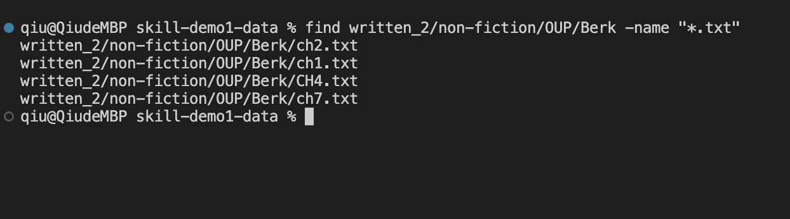
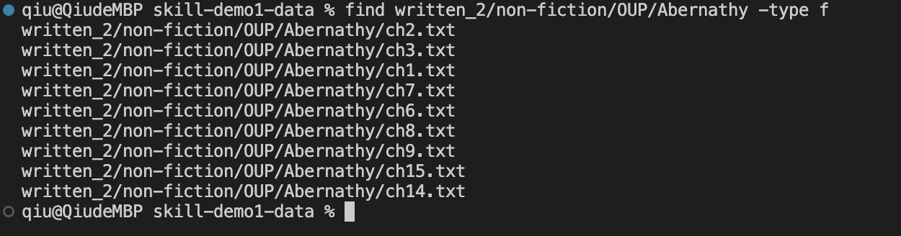
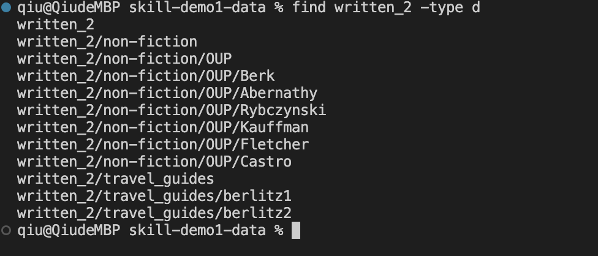
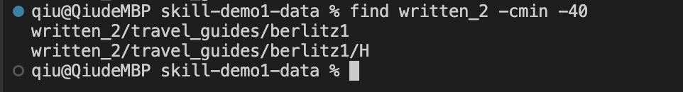
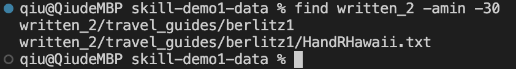

## Jiaqiu Wu Lab report3
# Researching Commands

I will find four different command-line options to use the "find" commands.

### find -name:
Example 1:

Find all files with ".txt" suffix in "written_2/non-fiction/OUP/Berk" folder.

Example 2:

Find all files with the file name "China-History.txt" in the "written_2" folder.

### find -type:
Example 1:

Find all files in "written_2/non-fiction/OUP/Abernathy" folder whose file type is normal file.

Example 2:

Find all the subfolds in "written_2" folder.

### find -cmin:
Example 1:

Find all files created within 40 minutes in "written_2" folder.

Example 2:

Find all files created within 5 minutes in "written_2" folder.

### find -amin:
Example 1:

Find all files accessed within 40 minutes in "written_2" folder.

Exmaple 2:

Find all files accessed within 5 minutes in "written_2" folder.
