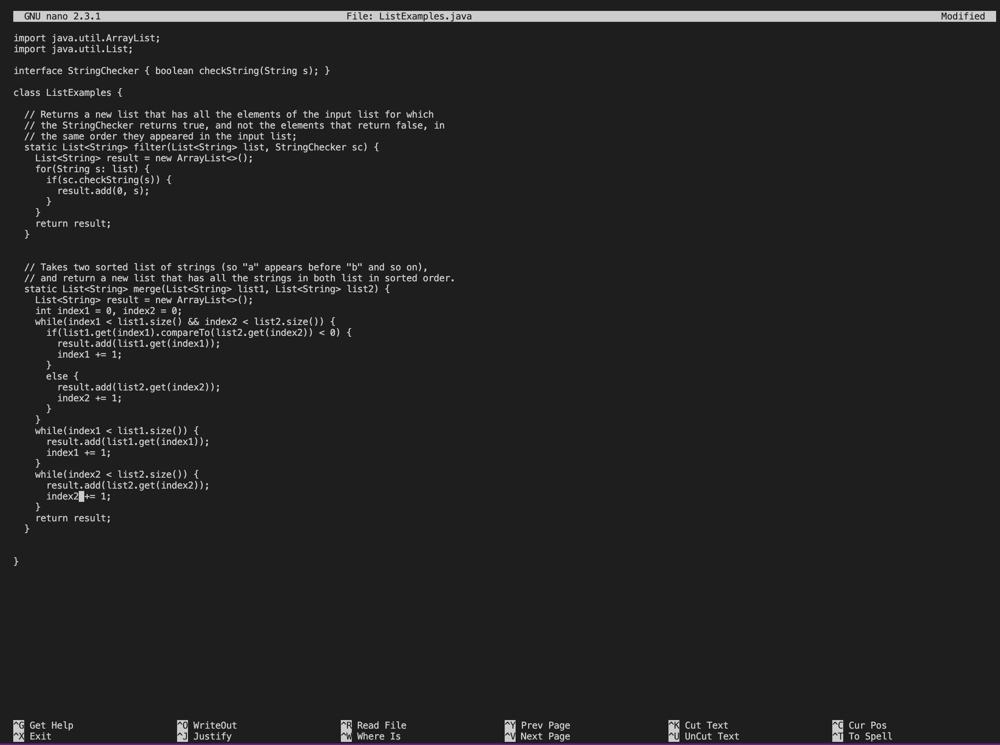
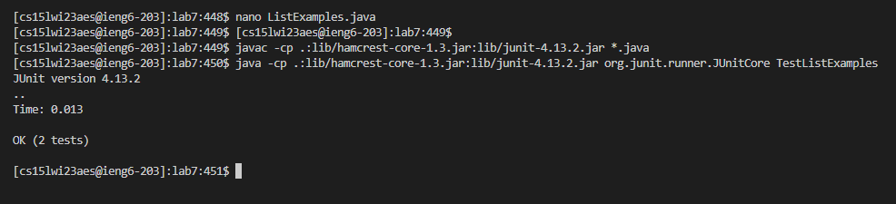

## Jiaqiu Wu Lab report 4
# Challenge task quick done

### Step 4:

 

Keys pressed: `ssh cs15lwi23aes@ieng6.ucsd.edu<enter>`
  
I typed and ran `ssh cs15lwi23aes@ieng6.ucsd.edu` command to log into my ieng6 account.

### Step 5:

Keys pressed: `git clone git@github.com:Qiu2023/lab7.git<enter>`

I typed and ran `git clone git@github.com:Qiu2023/lab7.git` command to clone my fork of the repository lab7 from my Github account.

### Step 6:

Keys pressed: `cd l<tab><enter>`, `<up><up><up><up><up><up><up><up><up><up><up><up><up><up><up><enter>`, `<up><up><up><up><up><up><up><up><up><up><up><up><up><up><up><enter>`

First, I typed `cd l` command meaning to switch current working directory to lab7, and then pressed `<tab>` to autofill the rest of the name "lab7" up. Then I pressed `<enter>` to run the command. \
Second, the `javac -cp .:lib/hamcrest-core-1.3.jar:lib/junit-4.13.2.jar *.java` command was 15 up in the search history, so I used up arrow to access it. \
Last, the `java -cp .:lib/hamcrest-core-1.3.jar:lib/junit-4.13.2.jar org.junit.runner.JUnitCore TestListExamples` command was 15 up in the history, so I accessed and ran it in the same way.

### Step 7:

Keys pressed: `nano ListExamples.java<enter>`, `<down><down><down><down><down><down><down><down><down><down><down><down><down><down><down><down><down><down><down><down><down><down><down><down><down><down><down><down><down><down><down><down><down><down><down><down><down><down><down><down><down><down><right><right><right><right><right><right><right><right><right><right><right><right><delete>1<control>o<enter>`

I firstly typed and ran `nano ListExamples.java` command to open the nano editor to edit the file ListExamples.java. \
Then, since the bug is at line 42, column 12, so I used down arrow and right arrow to reach it. \
Next, I pressed `<delete>` and then typed `1` to fix the bug. \
Finally, I pressed and held `<control>`, typed `o` and then pressed `<enter>` to save the file as its original name "ListExamples.java".

### Step 8:

Keys pressed: `<control>x`, `<up><up><up><enter>`, `<up><up><up><enter>`

First, I pressed and held `<control>` and typed `x` to exit the editor. \
Then, the `javac -cp .:lib/hamcrest-core-1.3.jar:lib/junit-4.13.2.jar *.java` command was 3 up in the search history, so I used up arrow to access it. \
Last, the `java -cp .:lib/hamcrest-core-1.3.jar:lib/junit-4.13.2.jar org.junit.runner.JUnitCore TestListExamples` command was 3 up in the history, so I accessed and ran it in the same way. We can see that both of the tests succeed.

### Step 9:

Keys pressed: `git status<enter>`, `git add L<tab>.j<tab><enter>`, `git commit -m "Updated"<enter>`, `git push origin main<enter>`

First, I typed and ran `git status` to check the state of ListExamples.java. \
Next, I typed `git add L` and then press `<tab>`, and typed `.j` and pressed <tab>, and then press `<enter>` to add the change in ListExamples.java in the working directory lab7 to the staging area. \
Then, I typed and ran `git commit -m "Updated"` to commit the change to the local repository lab7 with "Updated" as the commit message. \
Finally, I typed and ran `git push origin main` to push the resulting change to my Github account.
