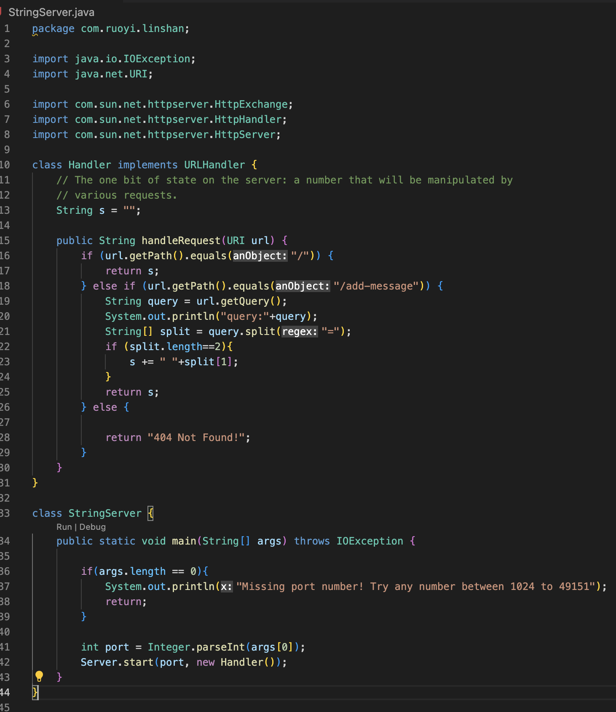
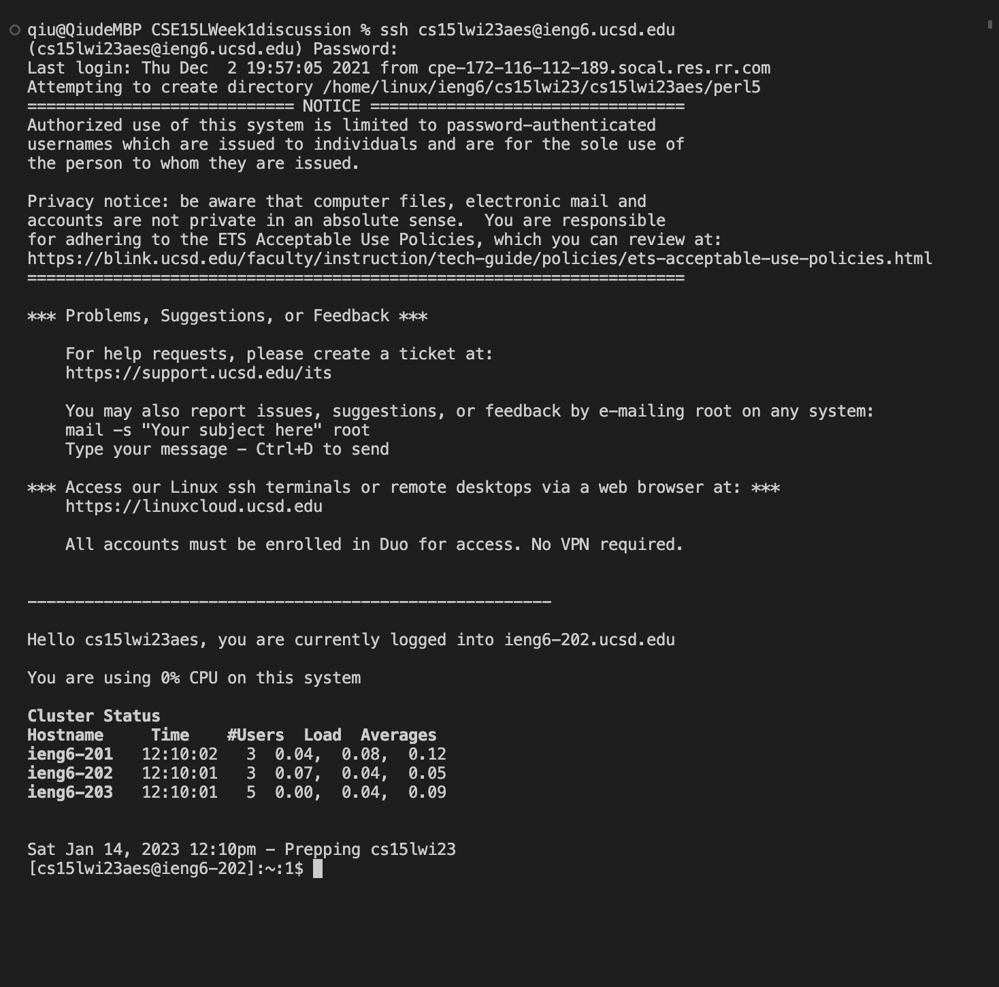
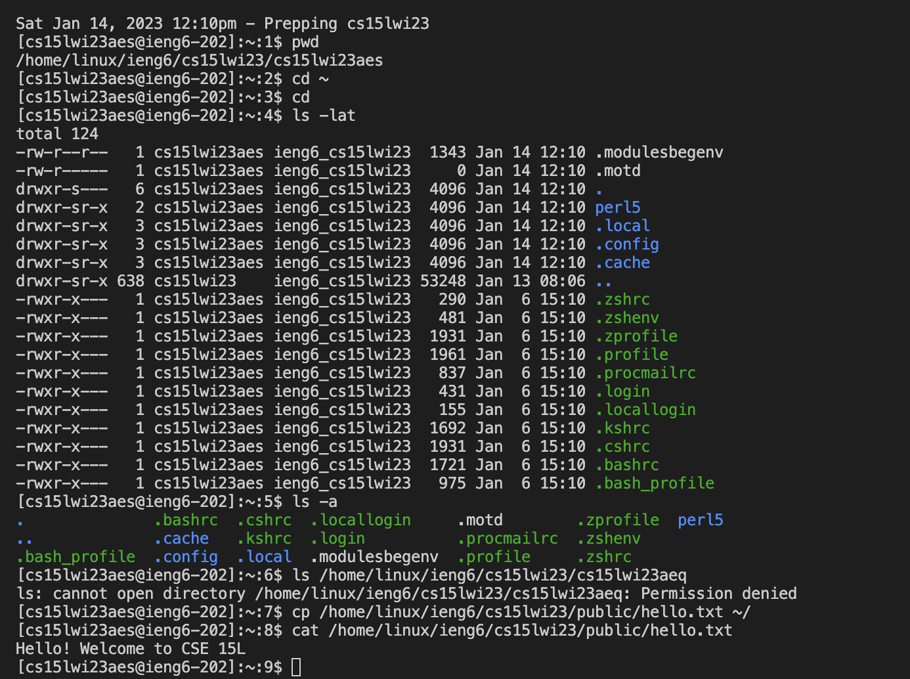

## Jiaqiu Wu Lab report1
# Remote Access - how to log into a course-specific account on ieng6

### STEP 1: Installing VScode
Download and install VScode for Macs or Windows on your computer.\
When installation completes, open VScode, and you will see a window like this:

### STEP 2: Remotely Connecting
Use the Terminal → New Terminal menu option to open a terminal in VScode.\
Type `ssh cs15lwi23xxx@ieng6.ucsd.edu` in the terminal where `xxx` is the letters in your course-specific account. The one of mine here is `aes`.\
If it is the first time you’ve connected to this server, you will probably get a message like this:\
`⤇ ssh cs15lwi23zz@ieng6.ucsd.edu
The authenticity of host 'ieng6.ucsd.edu (128.54.70.227)' can't be established.
RSA key fingerprint is SHA256:ksruYwhnYH+sySHnHAtLUHngrPEyZTDl/1x99wUQcec.
Are you sure you want to continue connecting (yes/no/[fingerprint])? `\
Type `yes` and press **enter**. Then type your own password of your course-specific account.\
If you successfully log in, you can see the whole interaction like this:

### STEP 3: Trying Some Commands
Congratulations! Your terminal is now remotely connected to a computer in the CSE basement. You can try to run some commands below, and these commands will also run on that computer.
- `pwd`
- `cd ~`
- `cd`
- `ls -lat`
- `ls -a`
- `ls <directory>` where `<directory>` is `/home/linux/ieng6/cs15lwi23/cs15lwi23abc`, where the `abc` is one of the other group members' username
- `cp /home/linux/ieng6/cs15lwi23/public/hello.txt ~/`
- `cat /home/linux/ieng6/cs15lwi23/public/hello.txt`\
After running all the commands above, you will see the whole interaction like this:

